# Deploying a `hello-world` Application with Vault-Injected Secrets

This repository contains the Kubernetes manifests and documentation to deploy a `hello-world` application that securely retrieves TLS certificates from HashiCorp Vault using the agent sidecar injector.

## Priority

This guide is organized into the following sections, in order of priority:

1. **Prerequisites**: Essential tools and setup required before you begin.
2. **Installation and Setup**: Installing and configuring the necessary tools (Minikube, Kubectl, Helm) and deploying Vault.
3. **Vault Configuration**: Configuring Vault to manage and inject secrets into your application.
4. **Application Deployment**: Deploying and patching the `hello-world` application to use the Vault sidecar.
5. **Verification**: Verifying that each step of the process was successful.

---

## Architecture Overview

This project demonstrates a secure secret management pattern in Kubernetes, leveraging HashiCorp Vault for dynamic TLS certificate injection.

The architecture consists of the following components:

* **Ingress**: An NGINX Ingress Controller that routes external traffic to the `hello-world` service.
* **Service**: A Kubernetes service that load balances traffic to the application pods.
* **Pod**: A Kubernetes pod running the `hello-world` application and the `vault-agent` sidecar.
* **Vault Agent Sidecar**: A sidecar container that authenticates with Vault and retrieves TLS certificates.
* **Vault Server**: A HashiCorp Vault server that stores and manages the TLS certificates.

Here is a high-level diagram of the request and secret flow:

```mermaid
graph TD
    subgraph Kubernetes Cluster
        A[🌐 Ingress] --> B[🔧 Service]
        B --> C[📦 Pod]
    end

    subgraph Pod
        C --> D[Container: hello-world]
        C --> E[Sidecar: vault-agent]
    end

    subgraph Vault
        F[Vault Server]
    end

    E --> F
    F --> E

    style A fill:#326ce5,stroke:#fff,stroke-width:2px,color:#fff
    style B fill:#326ce5,stroke:#fff,stroke-width:2px,color:#fff
    style C fill:#e0e0e0,stroke:#000,stroke-width:2px,color:#000
    style D fill:#4caf50,stroke:#fff,stroke-width:2px,color:#fff
    style E fill:#ff9800,stroke:#fff,stroke-width:2px,color:#fff
    style F fill:#f44336,stroke:#fff,stroke-width:2px,color:#fff
```



## 1. Prerequisites

* [Docker](https://www.docker.com/)

## 2. Installation and Setup

### Minikube

* [Minikube Installation](https://minikube.sigs.k8s.io/docs/start/)

```shell
minikube start --driver=docker && minikube addons enable ingress
```

### Kubectl

* [Kubectl Installation](https://kubernetes.io/docs/tasks/tools/)

### Helm

* [Helm Installation](https://helm.sh/docs/intro/install/)

### HashiCorp Vault

First, add the HashiCorp Helm repository and install Vault with the agent injector enabled.

```bash
# Add the HashiCorp Helm repo
helm repo add hashicorp https://helm.releases.hashicorp.com
helm repo update

# Install Vault in the 'vaultdemo' namespace
# The injector.enabled=true flag is crucial for this workflow.
helm install vault hashicorp/vault --namespace vaultdemo --create-namespace \
  --set "server.dev.enabled=true" \
  --set "injector.enabled=true"
```

> **Note:** We use `server.dev.enabled=true` for demonstration purposes. For production, you should use a proper storage backend like Consul or Integrated Storage.

## 3. Vault Configuration

### Generate and Store TLS Certificates

Next, we\'ll generate a self-signed TLS certificate and key and store them in Vault\'s KV secrets engine.

1. **Generate the TLS certificate and key:**

    ```bash
    openssl req -x509 -newkey rsa:4096 -keyout tls.key -out tls.crt \
    -days 365 -nodes -subj "/CN=hello-world.local"
    ```

2. **Copy certs into Vault Pod**:

    ```bash
    kubectl cp tls.crt vaultdemo/vault-0:/tmp/tls.crt
    kubectl cp tls.key vaultdemo/vault-0:/tmp/tls.key
    ```

3. **Store TLS Certificate and Key in Vault**

    ```bash
    # Ensure you are logged into Vault Pod
    kubectl exec -ti vault-0 -n vaultdemo -- /bin/sh

    # Store the certificate and key in the same secret path
    vault kv put secret/certs/hello-world \
    tls.crt=@/tmp/tls.crt \
    tls.key=@/tmp/tls.key

    # Verification
    vault kv get secret/certs/hello-world   
    ```

### Configure Vault-Kubernetes Integration

To allow the application pod to authenticate with Vault, we need to enable and configure the Kubernetes auth method.

1. **Enable the Kubernetes auth method**

    ```bash
    vault auth enable kubernetes

    # Verification
    vault auth list 
    ```

2. **Configure Kubernetes Auth (API Server, CA, JWT)**

    ```bash
    vault write auth/kubernetes/config \
        kubernetes_host="https://$(kubectl config view --minify -o jsonpath='{.clusters[0].cluster.server}' | sed 's|https://||')" \
        kubernetes_ca_cert=@/var/run/secrets/kubernetes.io/serviceaccount/ca.crt \
        token_reviewer_jwt=@/var/run/secrets/kubernetes.io/serviceaccount/token

    # Verification
    Not directly visible, but you can re-run the command or check Vault logs for successful configuration.
    ```

3. **Create a Vault Policy**

    ```bash
    # Create a policy named 'hello-world-policy' that allows reading the secret
    vault policy write hello-world-policy - <<EOF
    path "secret/data/certs/hello-world" {
    capabilities = ["read"]
    }
    EOF

    # Verification
    vault policy list
    vault policy read hello-world-policy
    ```

4. **Create a Vault Role (bind SA to policy)**

    ** that binds the policy to the application\'s Kubernetes Service Account (`app` in the `vaultdemo` namespace).

    ```bash
    vault write auth/kubernetes/role/hello-world \
    bound_service_account_names=app \
    bound_service_account_namespaces=vaultdemo \
    policies=hello-world-policy \
    ttl=24h \
    audience=https://kubernetes.default.svc.cluster.local

    # Verification
    vault write auth/kubernetes/role/hello-world
    ```

## 4. Application Deployment

### Deploy the `hello-world` Application

Apply all the application manifests. Note that the initial deployment does **not** contain the Vault annotations, so no sidecar will be injected yet.

```bash
# Apply all manifests from the directory
kubectl apply -f manifests -n vaultdemo
```

This will create:

* `ServiceAccount` (`app`) - `manifests/service-account-vault-agent.yaml`
* `Deployment` (`hello-world`) - `manifests/hello-world-deployment.yaml`
* `Service` (`hello-world`) - `manifests/hello-world-service.yaml`
* `Ingress` (`hello-world-ingress`) - `manifests/hello-world-ingress.yaml`

### Verify Step 4

Check the status of the `hello-world` pod. It should be in the `Running` state, but it will only have one container.

```bash
kubectl get pods -n vaultdemo -l app=hello-world
```

You can also describe the pod to see that the Vault annotations are not yet present.

```bash
POD_NAME=$(kubectl get pods -n vaultdemo -l app=hello-world -o jsonpath='{.items[0].metadata.name}')
kubectl describe pod $POD_NAME -n vaultdemo
```

### Patch the Deployment to Inject Secrets

Now, we will use `kubectl patch` to apply the Vault annotations to the live `hello-world` Deployment. This change to the pod template will trigger a rolling update. The new pod will be created with the Vault agent injector sidecar.

```bash
kubectl patch deployment hello-world \
  --namespace vaultdemo \
  --patch-file manifests/patch-annotations.yaml
```

The Vault webhook will detect the annotations on the new pod and inject the `vault-agent` init and sidecar containers. The agent will authenticate using the `hello-world` role and render the TLS certificates into the pod\'s filesystem.

### Verify Step 5

A new pod will be created. Check that the new pod has two containers (the application container and the `vault-agent` sidecar).

```bash
kubectl get pods -n vaultdemo -l app=hello-world
```

The `READY` column should show `2/2`.

Once the new pod is in the `Running` state, you can verify that the secrets were successfully injected.

1. **Get the new pod\'s name:**

    ```bash
    # The pod name will have a different hash from the original one
    POD_NAME=$(kubectl get pods -n vaultdemo -l app=hello-world -o jsonpath='{.items[0].metadata.name}')
    ```

2. **Check for the secret files inside the pod:**

    ```bash
    kubectl exec -it $POD_NAME -n vaultdemo -- ls /vault/secrets
    ```

    You should see `tls.crt` and `tls.key` listed in the output, confirming the process was successful.

---
